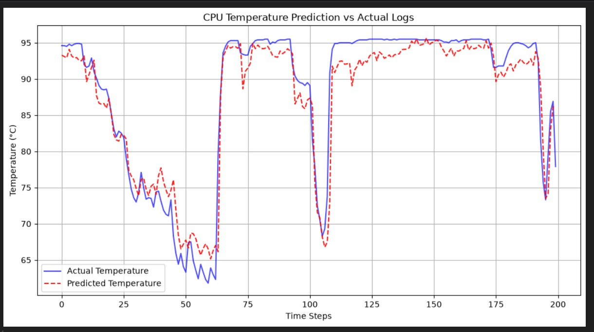
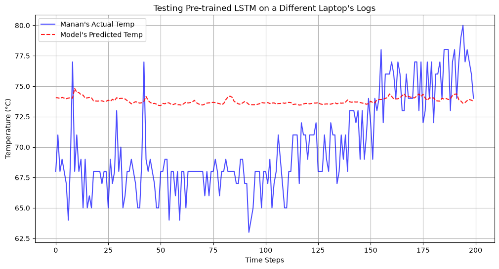

# 🌡️ CPU Temperature Predictor (LSTM) 

  

  <em>Actual vs Predicted CPU temperature on test telemetry logs</em>

  

  <em>Cross-hardware test (trained on one laptop, evaluated on another laptop)</em>

---

## 📋 Model Summary (Evaluation Panel)

| Section | Details |
|---|---|
| **Model Used** | **Stacked LSTM Regressor** (TensorFlow/Keras Sequential) |
| **Architecture** | LSTM(64, `return_sequences=True`) → Dropout(0.2) → LSTM(64, `return_sequences=False`) → Dropout(0.2) → Dense(1) |
| **Input Features (6)** | `cpuUsage`, `ramUsage`, `networkConnections`, `processCount`, `cpuPackagePower`, `cpuAverageClock` |
| **Target Variable** | `cpuTemperature` |
| **Window / Lookback** | **8** timesteps |
| **Train/Test Split** | 80% / 20% (chronological split, no shuffling) |
| **Scaling** | MinMax normalization for both features and target (`scaler_X`, `scaler_Y`) |
| **Optimizer** | Adam |
| **Loss Function** | Mean Squared Error (MSE) |
| **Training Hyperparameters** | Epochs = **40**, Batch Size = **32**, Dropout = **0.2** |
| **Evaluation Metrics (Test Set)** | **MAE = 2.00 °C**, **RMSE = 5.09 °C**, **R² = 0.8076** |
| **Cross-Hardware Result** | On Manan logs: **MAE = 3.53 °C**, **RMSE = 4.83 °C**, **R² = 0.8403**. Despite these aggregate metrics, the prediction curve remains nearly flat and does not follow rapid thermal changes, so the model is **not reliable for different-hardware datasets**. |
| **Key Features of This Version** | ✅ Updated hyperparameters for improved stability    ✅ Sequence-aware forecasting for proactive thermal monitoring    ✅ Independent scaling to reduce data leakage risk    ✅ Cross-device validation included for robustness |

---

## 🎯 Why this version is strong

- Captures temporal thermal dynamics using recurrent memory (`LSTM`).
- Maintains low prediction error on in-domain test data.
- Suitable for thermal risk alerting, load balancing support, and predictive system management.

---

## ⚠️ Important Limitation (Cross-Hardware)

When telemetry is collected from a **different hardware platform**, this model is currently **not able to make reliable predictions**.  
The cross-hardware graph shows that predictions stay close to a narrow band and fail to track real temperature swings.
