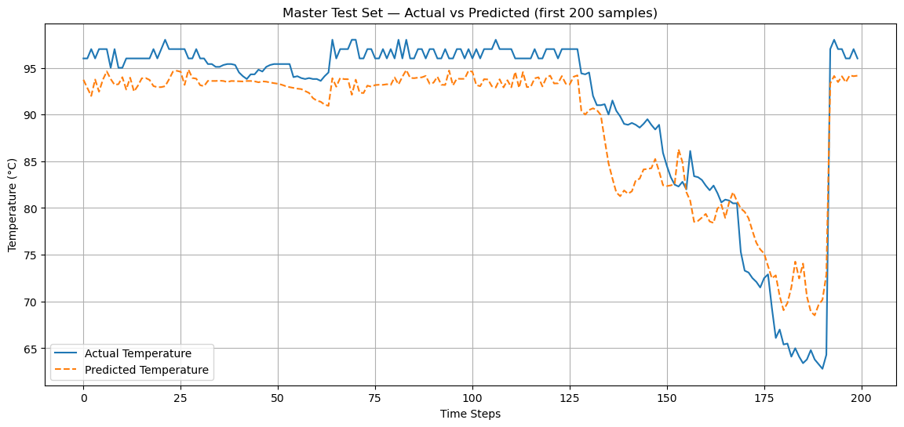
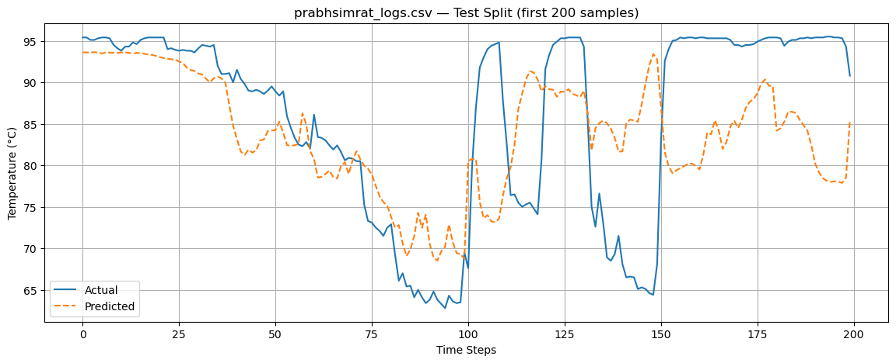
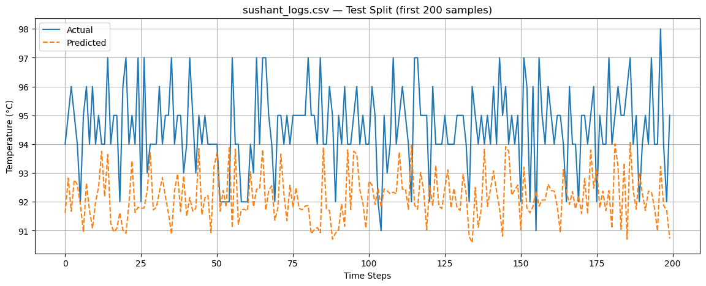
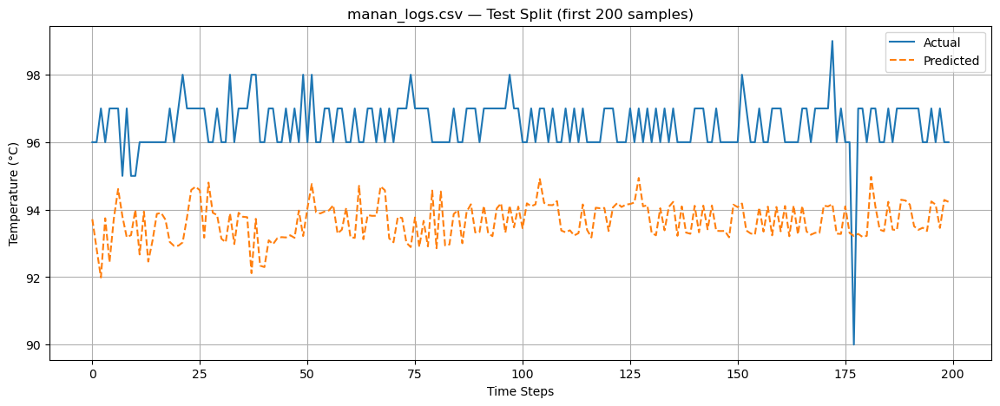

# 🔥 Thermal-Aware CPU Temperature Prediction using LSTM

A deep learning project for forecasting CPU temperature from real-time hardware telemetry collected across multiple laptops. The objective is to predict future CPU temperatures using historical system metrics, enabling proactive thermal management and intelligent scheduling for thermal-aware load balancing systems.

---

# 📊 Prediction Results

<table>
<tr>
<td align="center">

### Master Test Set


</td>

<td align="center">

### Prabhsimrat Logs


</td>
</tr>

<tr>
<td align="center">

### Sushant Logs


</td>

<td align="center">

### Manan Logs


</td>
</tr>
</table>

---

# 📑 Model Summary

| Property | Value |
|----------|-------|
| Model | Bidirectional LSTM |
| Framework | TensorFlow / Keras |
| Input Sequence Length | 20 timesteps |
| Prediction Target | Next CPU Temperature |
| Features | 7 Hardware Telemetry Features |
| Optimizer | Adam |
| Loss Function | Mean Squared Error (MSE) |
| Evaluation Metrics | MAE, RMSE, R² |
| Train/Validation/Test Split | 80% / 10% / 10% |
| Hardware Used | NVIDIA RTX 4060 Laptop GPU |

---

# 📂 Dataset

The model was trained using telemetry collected from **three different laptops**, improving hardware diversity and evaluating cross-device generalization.

| Dataset | Train | Validation | Test |
|---------|-------|------------|------|
| Prabhsimrat Logs | 13,088 | 1,636 | 1,637 |
| Sushant Logs | 12,874 | 1,609 | 1,610 |
| Manan Logs | 16,191 | 2,024 | 2,024 |

Combined master dataset:

| Split | Samples |
|-------|---------|
| Train | 42,006 |
| Validation | 5,122 |
| Test | 5,124 |

---

# 📊 Features Used

The LSTM receives the following hardware telemetry as input:

- CPU Usage
- CPU Average Clock
- CPU Package Power
- CPU Temperature
- CPU Core Maximum Temperature
- GPU Usage
- GPU Temperature

Each prediction uses the previous **20 timesteps** to forecast the next CPU temperature.

---

# 🧠 Model Architecture

```
Input Sequence (20 × 7)

        │

Bidirectional LSTM
Hidden Size = 64
2 Layers

        │

Dropout (0.1)

        │

Fully Connected Layer

        │

Predicted CPU Temperature
```

---

# ⚙️ Training Configuration

| Hyperparameter | Value |
|---------------|-------|
| Hidden Size | 64 |
| LSTM Layers | 2 |
| Bidirectional | Yes |
| Dropout | 0.10 |
| Batch Size | 32 |
| Lookback Window | 20 |
| Learning Rate | 0.00779 |
| Weight Decay | 1.125×10⁻⁶ |
| Optimizer | Adam |
| Scheduler | ReduceLROnPlateau |
| Early Stopping | Enabled |

---

# 📈 Training Performance

The training and validation losses converged smoothly without significant divergence, indicating stable optimization.

Final Training Loss

```
0.004851
```

Final Validation Loss

```
0.003789
```

Validation Gap

```
21.9%
```

This indicates only **mild overfitting**, suggesting that the model generalizes reasonably well while maintaining low prediction error.

---

# 📊 Test Performance

| Test Dataset | MAE (°C) | RMSE (°C) | R² Score |
|--------------|---------:|----------:|---------:|
| **Sushant Logs** | **2.36** | **2.67** | **-4.3402** |
| **Prabhsimrat Logs** | **8.40** | **10.89** | **0.0975** |
| **Manan Logs** | **5.19** | **7.51** | **0.3642** |

---

# 📈 Comparison with Persistence Baseline

The persistence baseline simply predicts:

```
Next Temperature = Current Temperature
```

| Dataset | LSTM MAE (°C) | Persistence MAE (°C) | Improvement |
|----------|--------------:|---------------------:|------------:|
| **Prabhsimrat** | **1.525** | **1.458** | **-4.58%** |
| **Sushant** | **1.015** | **0.994** | **-2.10%** |
| **Manan** | **1.523** | **1.477** | **-3.14%** |

> A negative improvement indicates that the persistence baseline slightly outperformed the LSTM on all three datasets.

# 📖 Interpretation

The persistence baseline consistently performs slightly better than the LSTM across all three datasets.

This changes the interpretation of the current model.

Although the prediction plots appear visually accurate, much of this behaviour is due to reconstructing the predicted temperature using the current reading and the predicted delta.

The forecasting task is currently too easy because adjacent CPU temperature readings change only slightly over short logging intervals. Consequently, predicting the next temperature becomes nearly identical to copying the current one, leaving very little room for the neural network to outperform a trivial baseline.

---

# ⚠️ Current Limitation

The model currently predicts

```
Last 20 readings
        ↓
Next CPU Temperature
```

For thermal-aware scheduling and proactive load balancing, this prediction horizon is too short to provide meaningful advance warning.

---

# 🚀 Future Work

The next stage of this project is to shift from one-step forecasting to long-horizon prediction.

Instead of predicting the immediate next temperature, the model will forecast temperatures **30–60 seconds into the future**, allowing the scheduler to react before thermal throttling occurs.

Future improvements include:

- Multi-step forecasting
- Longer prediction horizons
- Additional hardware telemetry features
- Attention-based LSTM architectures
- Transformer-based sequence models
- Deployment for real-time thermal-aware scheduling

---

# 📌 Conclusion

The proposed Bidirectional LSTM successfully learns relationships between CPU workload and temperature across multiple hardware platforms. However, comparison with the persistence baseline shows that one-step temperature forecasting does not provide sufficient predictive advantage.

This insight is valuable because it motivates the transition toward longer-horizon forecasting, where deep learning models are expected to outperform simple heuristic approaches and provide practical benefits for intelligent thermal-aware load balancing systems.